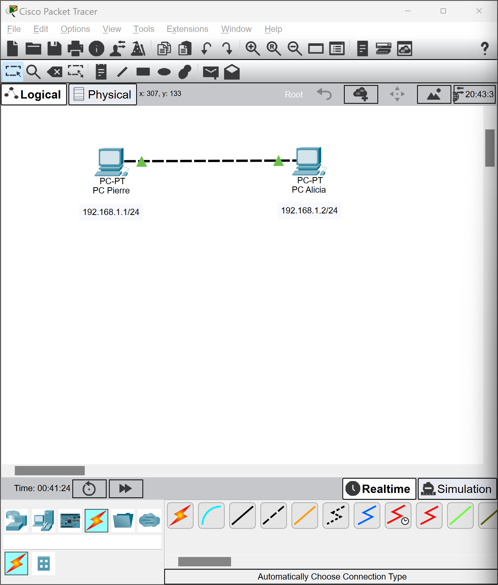
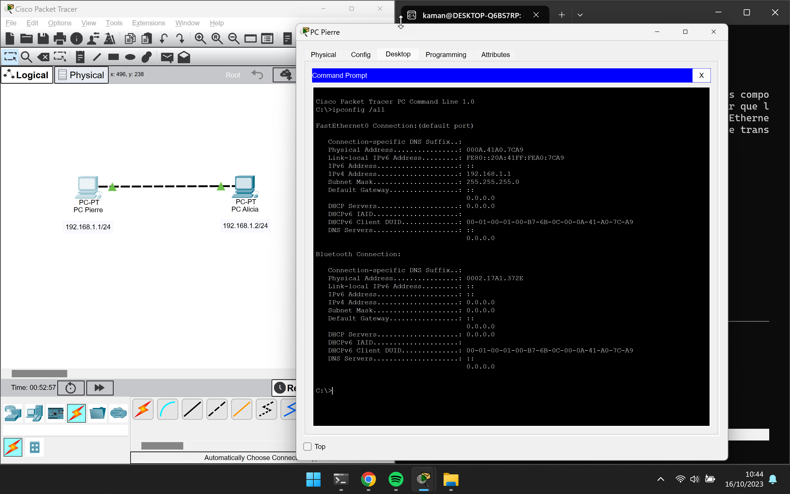
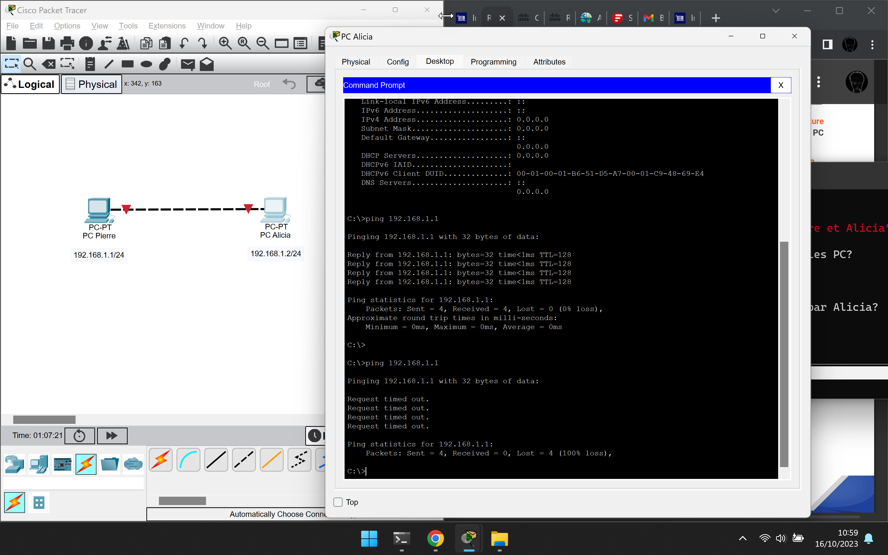

# Le réseau

## Job 1: Installation de Cisco Packet Tracer
- Inscription sur la page: [skillsforall.com](https://skillsforall.com/)
- Démarrage du cours: [Notions de base sur les réseaux](https://skillsforall.com/course/networking-basics?courseLang=fr-FR)
- Téléchargement de Packet Tracer: [Packet Tracer 8.2.1](https://skillsforall.com/resources/lab-downloads?courseLang=fr-FR)


## Job 2
- Qu'est-ce qu'un réseau?

Ensemble d'objets interconnectés les uns aux autres permettant de faire
circuler des éléments entre chacun de ces objets selon des règles bien
définies (ex: réseau routier, réseau d'eau, réseau électrique...)

- A quoi sert un réseau informatique?

Un réseau informatique sert par à faire circuler de l'information entre les ordinateurs,
terminaux et objets interconnectés.

- Quel matériel avons-nous besoin pour construire un réseau?

Pour construire un réseau informatique nous avons besoin:
d'une couche physique (carte réseau (Ethernet/Wifi/Fibre), switch/Access Point Wireless, routeur, cables)
de protocoles d'adressages et de communications
d'applications pour traiter et transmettre les informations

## Job 3
Les ordinateurs de Pierre et Alicia sont directement connectés entre eux sans passé par des composants
réseaux actifs comme un switch ou un routeur. Le cable choisit doit donc être croisée pour que la
communication puissse s'effectuée entre les deux machines. La connexion réseau est "Fast Ethernet"
c'est-à-dire qu'elle est asynchrone et bi-directionnelle ce qui permet d'avoir une vitesse de transmission
de 100Mb/s au lieu des 10Mb/s en "Ethernet".

## Job 4
- Qu'est-ce qu'une adresse IP?

C'est un numéro d'identification unique attribué de façon provosoire ou permanente
à chaque périphérique faisant partie d'un même réseau informatique utilisant l'Internet Protocol.

- A quoi sert un IP?

Une IP sert à déterminer de manière unique un élément du réseau (comme une adresse postale en somme)

- Qu'est-ce qu'une adresse MAC?

Une adresse MAC (Media Access Control) est un identifiant physique stocké dans une interface réseau.
Elle est unique au monde. Cette adresse est la partie inférieure de la couche liaison.

- Qu'est-ce qu'une IP publique et privé?

Une adresse IP publique est attribué par le fournisseur d'accès à internet au routeur faisant office de
passerelle entre un sous-réseau privé et Internet. Elle est accessible et identifiable par tous.

Une adresse IP privée est une adresse d'un sous-réseau local seulement accessible depuis les terminaux
appartenant à ce même sous-réseau.



## Job 5




- Quelle ligne de commande avez-vous utilisée pour vérifier l'id des machines?
```bash
# Commande permettant d'avoir les informations réseaux
ipconfig /all
```

## Job 6


- Quelle est la commande permettant de Ping entre les PC?
```bash
# Commande employée sur l'ordinateur de Pierre
ping 192.168.1.2

# Commande employée sur l'ordinateur d'Alicia
ping 192.168.1.1
```

## Job 7



- Le PC de Pierre a-t-il reçu les paquets envoyés par Alicia?
- Expliquez pourquoi.

Le PC de Pierre n'a pas pu recevoir les paquets icmp émis par Alicia, puisque son
ordinateur est éteint et que sa carte réseau ne traite plus les paquets envoyés par le cable réseau.

## Job 8

- Quelle est la différence entre un hub et un switch?
- Comment fonctionne un hub et quels sont ses avantages et ses inconvénients?
- Quels sont les avantages et inconvénients d'un switch?
- Comment un switch gère-t'il le réseau?

En utilisant un hub, chaque équipement attaché à celui-ci partage le même domaine de diffusion ainsi
que le même domaine de collision2. Comme dans tout segment de réseau Ethernet, une seule des machines
connectées peut y transmettre à la fois. Dans le cas contraire, une collision se produit, les machines
concernées doivent retransmettre leurs trames après avoir attendu un temps calculé aléatoirement par
chaque émetteur.

Ce dispositif est un répéteur de données ne permettant pas de protection particulière des données
et transmettant les trames à toutes les machines connectées par opposition au commutateur réseau
(en anglais switch) qui dirige les données uniquement vers la machine destinataire. Ceci le rend
vulnérable aux attaques par Analyseur de paquets. Il permet également d'étendre un réseau local (LAN)
mais ne permet pas de le transformer en un réseau étendu (WAN).

On peut mettre au maximum 4 hubs Ethernet séparés par un câble de 100 mètres
(Distance maximale théorique de transfert via câble Ethernet. La fibre optique quant à elle pourrait
permettre des séparations allant jusqu'à plusieurs kilomètres.), soit 300 m de câble. L'interface réseau
envoie d'abord un préambule de synchronisation avant d'envoyer le paquet afin de limiter le nombre de collisions.
Cependant, s'il y a une collision, les deux machines qui veulent « parler » tireront un nombre 
au sort (correspondant à une durée) qui sera additionné au timestamp, durée aller-retour.
Une collision est détectée quand le paquet n'est plus compréhensible par la ou les interface(s) réseau.

Pour ces raisons, ce type d'appareil a tendance à tomber en désuétude au profit du commutateur réseau.

Le hub possède deux types de ports ou connecteurs physiques :

1) les ports pour la connexion des machines ;
2) le port pour extension du réseau auquel se connecte un autre concentrateur 
(il n'y en a généralement qu'un seul par concentrateur). Ce type de port est identique
au précédent à l'exception du câblage qui est inversé (on peut aussi utiliser un câble
à connecteur RJ45 croisé pour y connecter un ordinateur supplémentaire).

Un commutateur réseau, ou switch, est un équipement qui relie plusieurs segments (câbles ou fibres)
dans un réseau informatique et de télécommunication et qui permet de créer des circuits virtuels.
La commutation est un des deux modes de transport de trame au sein des réseaux informatiques et de
communication, l'autre étant le routage1. Dans les réseaux locaux (LAN), il s'agit le plus souvent
d'un boîtier disposant de plusieurs ports RJ45 (entre 4 et plusieurs centaines), il a donc la même
apparence qu'un concentrateur (hub). Il existe aussi des commutateurs pour tous les types de réseau
en mode point à point comme pour les réseaux ATM, relais de trames, etc.

Contrairement à un concentrateur, un commutateur ne reproduit pas sur tous les ports chaque trame qu'il
reçoit : il sait déterminer sur quel port il doit envoyer une trame, en fonction de l'adresse de destination
de cette trame. Les commutateurs sont souvent utilisés pour remplacer des concentrateurs car ils encombrent
moins le réseau. Dans le cas d'un réseau IP/Ethernet, un commutateur ne s'intéresse pas à la même couche
OSI que le routeur, ils utilisent respectivement les adresses MAC et les adresses IP pour diriger les données.
Concrètement, pour une adresse qui peut être partiellement connue, une trame est toujours émise sur le même port,
quel que soit l'état du trafic, une fois ses tables de routage et de communication remplies. Le routeur,
lui, cherche à déterminer la meilleure route, il est susceptible de générer moins de trafic pour des grands
réseaux.

Il est fréquent qu'un commutateur intègre, par exemple, le Spanning Tree Protocol que l'on rencontre dans
les ponts. Le commutateur est d'ailleurs souvent vu d'une manière réductrice comme un pont multiport.

Le commutateur établit et met à jour une table, dans le cas du commutateur pour un réseau Ethernet il
s'agit de la table d'adresses MAC, qui lui indique sur quels ports diriger les trames destinées à une
adresse MAC donnée, en fonction des adresses MAC source des trames reçues sur chaque port. Le commutateur
construit donc dynamiquement une table qui associe numéro de port et adresses MAC.

Lorsqu'il reçoit une trame destinée à une adresse présente dans cette table, le commutateur renvoie la
trame sur le port correspondant. Si le port de destination est le même que celui de l'émetteur, la trame
n'est pas transmise. Si l'adresse du destinataire est inconnue dans la table, alors la trame est traitée
comme un broadcast, c'est-à-dire qu'elle est transmise à tous les ports du commutateur à l'exception du port
d'émission.

Un commutateur de niveau 2 est similaire à un concentrateur dans le sens où il fournit un seul domaine de
diffusion. En revanche, chaque port a son propre domaine de collision. Le commutateur utilise la
micro-segmentation pour diviser les domaines de collision, un par segment connecté. Ainsi, seules les
interfaces réseau directement connectées par un lien point à point sollicitent le medium. Si le commutateur
auquel il est connecté prend en charge le full-duplex, le domaine de collision est éliminé.


## Job 9

- Faire un schéma de votre réseau
(Doit représenter la topologie et la configuration du réseau en incluant les composants)


- Identifier au moins trois avantages importants d'avoir un schéma

## Job 10

- Quelle est la différence entre une adresse IP statique et une adresse IP attribuée par DHCP?

## Job 11
Attribution d'une adresse de classe A 10.0.0.0
Création de 16 sous-réseau(x) pour 322 hôtes:
- 1 sous-réseau de 12 hôtes     10.0.0./
- 5 sous-réseaux de 30 hôtes    10.0.0./
- 5 sous-réseaux de 120 hôtes   10.0.0./
- 5 sous-réseaux de 160 hôtes   10.0.0./

Pour générer l'ensemble du plan d'adressage nous avons évalué au plus juste les besoins de chaque
sous-réseaux. Donc il est possible que l'on ne puisse pas ajouter un nouvel hôte sur certain
de ces sous-réseaux. Le calcul est effectué de tel manière que l'on essaye d'économiser au
maximum les adresses IPs en ne prévoyant pas des sous-réseaux avec une grande perte d'adresses IPs
non utilisées.

Ci-dessous le code Python ayant servit à définir notre plan d'adressage automatiquement pour l'ensemble
des sous-réseaux:
```Python

```


### Définissons le plan d'adressage

- Pourquoi a-t-on choisi une adresse 10.0.0.0 de classe A

- Quelle est la différence entre les différents types d'adresses?

## Job 12
Tableau des sept couches du modèle OSI (description des rôles de chaque couche)

|  **Couche**   |   **Nom** |   **Rôle** |
|:--:    |:-:    |---    |
|   7   |   Application   | Service applicatif au plus proche des utilisateurs  |
|   6   |   Présentation  | Encode, chiffre et compresse les données utiles |
|   5   |   Session   |   Etablit des sessions entre les applications   |
|   4   |   Transport   |   Etablit, maintient et termine des sessions entre des périphériques terminaux |
|   3   |   Réseau  |   Adresse les interfaces globalement et détermine les meilleurs chemins à travers un inter-réseau |
|   2   |   Liaison de données  |   Adresse localement les interfaces, livre les informations localement, méthode MAC   |
|   1   |   Physique    |   Encodage du signal, câblage et connecteurs, spécifications physiques    |

Associez les différentes matériels ou protocoles aux couches
| **Matériel / Protocole**  |   **Couche**  |
|:--:    |:--:    |
|   Ethernet    |   1   |
|   TCP |   4   |
|   MAC |   2   |
|   Fibre optique   |   1   |
|   PPTP    |   2   |
|   IPv4    |   3   |
|   SSL/TLS |   6   |
|   WIFI    |   1   |
|   IPv6    |   3   |
|   UDP |   4   |
|   FTP |   5   |
|   routeur |   3   |
|   HTML    |   6   |
|   Cable RJ45  |   1   |

## JOB 13

- Quell est l'architecture de ce réseau?
Taupologie en étoile
- Indiquer quelle est l'adresse IP du réseau?
192.168.10.0/24

- Quelle est l'adresse de diffusion de ce réseau?
192.168.10.255

## JOB 14
Conversion des adresses IP en binaire
Pour ne pas trop s'embéter à tout faire à la main on peut écrire un petit script convertissant
l'adresse IP en binaire:
```python
  1 #!/usr/bin/python3
  2 #
  3 # Author: Cyril GENISSON
  4 # Created: 16/10/2023
  5 # Updated: 16/10/2023
  6 #
  7 # Nom du script: ip_binaire.py
  8 # Description: converti les adresses IP du Job14 en format binaire
  9 # Il y a sûrement plus simple à faire mais bon...
 10
 11 ip_list = ["145.32.59.24", "200.42.129.16", "14.82.19.54"]
 12
 13 for i in range(len(ip_list)):
 14     chaine, ip_binary = "", ""
 15     for j in range(len(ip_list[i])):
 16         if ip_list[i][j] != "." :
 17             chaine += str(ip_list[i][j])
 18         else:
 19             ip_binary +=str(bin(int(chaine))[2:].zfill(8))
 20             chaine = ""
 21     ip_binary +=str(bin(int(chaine))[2:].zfill(8))
 22     print(ip_list[i], ": ",ip_binary)
```

| **Adresse IPv4** |    **Format binaire** |
|:--:   |:--:   |
|   192.168.0.1 | 11000000 10101000 00000000 00000001 |
|   145.32.59.24    |   10010001 00100000 00111011 00011000 |
|   200.42.129.16   |   11001000 00101010 10000001 00010000 |
|   14.82.19.54 |   00001110 01010010 00010011 00110110 |

**Remarque:** On n'aurait pu se servir d'une partie du code du Job11 mais nous n'avions
rien de mieux à faire que de réinventer la roue...

## JOB 15

- Qu'est-ce que le routage?

Le routage est le processus de sélection du chemin dans un réseau. Un réseau informatique est
composé de nombreuses machines, appelées nœuds, et de chemins ou de liaisons qui relient ces nœuds.
La communication entre deux nœuds d'un réseau interconnecté peut s'effectuer par de nombreux
chemins différents. Le routage est le processus qui consiste à sélectionner le meilleur chemin
à l'aide de certaines règles prédéterminées.

- Qu'est-ce qu'un gateway?

Une passerelle, ou gateway, s’exploite dans les réseaux de télécommunications afin de permettre aux
données de circuler d'un réseau à un autre. Les passerelles se distinguent des routeurs ou des commutateurs
en ce sens qu'elles communiquent en exploitant plus d'un protocole pour connecter un ensemble de réseaux
et peuvent fonctionner sur n'importe laquelle des sept couches du modèle d'interconnexion des systèmes
ouverts (OSI).
 
Une passerelle réseau, ou network gateway, assure l'interopérabilité entre les réseaux et contient
des dispositifs, tels que :
- des traducteurs de protocole,
- des adaptateurs d'impédance (la pratique consistant à maximiser le transfert de puissance ou à
minimiser la réflexion du signal par la charge),
- des convertisseurs de taux,
- des isolateurs de défauts, un défaut désignant une condition anormale ou un défaut au niveau
d'un composant, d'un équipement ou d'un sous-système qui peut entraîner une défaillance,
- des traducteurs de signaux.
 
Une passerelle réseau nécessite l'établissement de procédures administratives mutuellement acceptables
entre les réseaux utilisant la passerelle.
 
Les passerelles de réseau peuvent effectuer des conversions de protocole pour connecter des réseaux
exploitant différentes technologies de protocole de réseau. Par exemple, une passerelle de réseau
relie un intranet de bureau ou domestique à Internet. Si l’internaute veut charger une page web, il accède
à au moins deux passerelles de réseau : une pour passer du réseau du bureau ou de la maison à Internet
et une pour passer d’ Internet à l'ordinateur qui sert la page web.

- Qu'est-ce qu'un VPN?

VPN signifie Virtual Private Network, que l'on peut traduire en français : réseau privé virtuel,
ce qui nous donne RPV. Mais, dans la pratique nous entendons toujours parler de VPN.
L'objectif est de créer un lien virtuel entre deux points, par exemple entre deux réseaux d'entreprise,
ou entre un PC client et un réseau d'entreprise. Au sein de ce lien, les données seront sécurisées et
isolées du reste du traffic, c'est là tout l'intérêt du VPN et cette notion de "privé". Le VPN permet de
créer une extension virtuelle de votre réseau local jusqu'à un autre réseau (site) ou jusqu'à un
poste de travail distant.

Le VPN va chiffrer les données de bout-en-bout, c'est-à-dire de l'équipement qui
ouvre le tunnel jusqu'à son point de terminaison. Grâce à cela, il renforce la confidentialité
des échanges au travers de réseaux non sécurisés

- Qu'est-ce qu'un DNS?
Le Domain Name System (ou DNS, système de noms de domaine) est un service permettant
d'établir une correspondance entre une adresse IP et un nom de domaine et, plus généralement,
de trouver une information à partir d'un nom de domaine.
