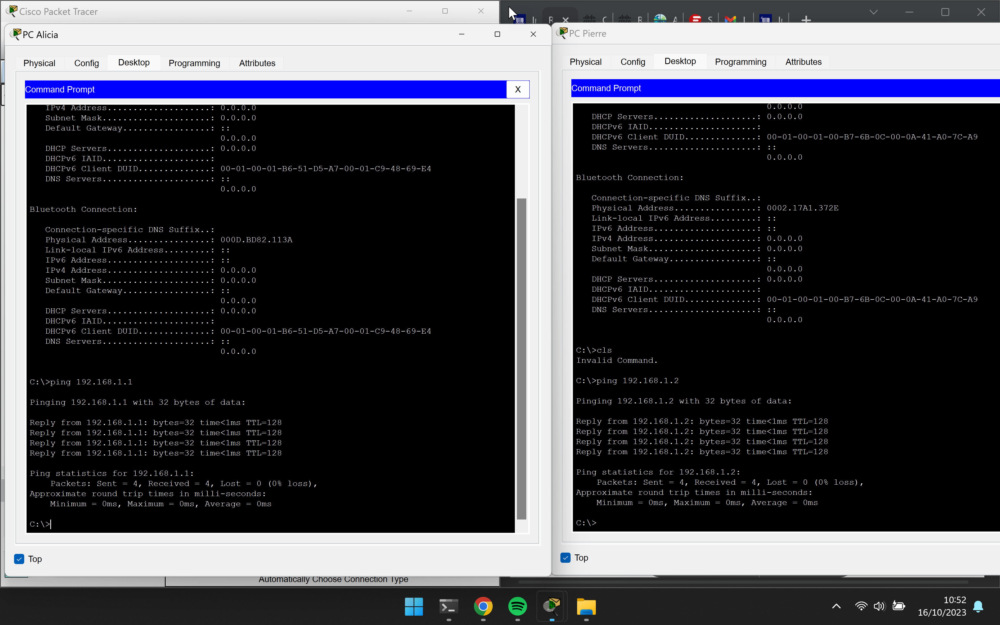
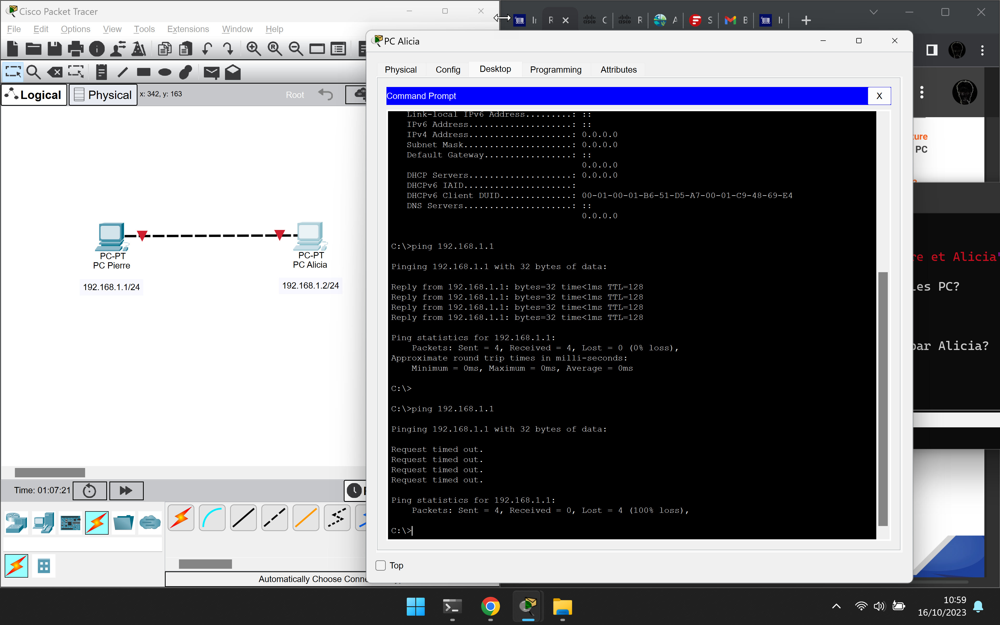

# Le réseau

## Joba 1: Installation de Cisco Packet Tracer
- Inscription sur la page: [skillsforall.com](https://skillsforall.com/)
- Démarrage du cours: [Notions de base sur les réseaux](https://skillsforall.com/course/networking-basics?courseLang=fr-FR)
- Téléchargement de Packet Tracer: [Packet Tracer 8.2.1](https://skillsforall.com/resources/lab-downloads?courseLang=fr-FR)
![Installation de Packet Tracer] (./pictures/install_packet_tracer_job1.jpg "Cisco Packet Tracer)

## Job 2
- Qu'est-ce qu'un réseau?

- A quoi sert un réseau informatique?

- Quel matériel avons-nous besoin pour construire un réseau?

## Job 3
Les ordinateurs de Pierre et Alice sont directement connectés entre eux sans passé par des composants
réseaux actifs comme un switch ou un routeur. Le cable choisit doit donc être croisée pour que la
communication puissse s'effectuée entre les deux machines. La connexion réseau est "Fast Ethernet"
c'est-à-dire qu'elle est asynchrone bi-directionnelle ce qui permet d'avoir une vitesse de transmission
de 100Mb/s au lieu des 10Mb/s en "Ethernet".

## Job 4
- Qu'est-ce qu'une adresse IP?

- A quoi sert un IP?

- Qu'est-ce qu'une adresse MAC?

- Qu'est-ce qu'une IP publique et privé?


## Job 5


- Quelle ligne de commande avez-vous utilisée pour vérifier l'id des machines?

## Job 6



- Quelle est la commande permettant de Ping entre les PC?

## Job 7



- Le PC de Pierre a-t-il reçu les paquets envoyés par Alicia?

- Expliquez pourquoi.

## Job 8

- Quelle est la différence entre un hub et un switch?

- Comment fonctionne un hub et quels sont ses avantages et ses inconvénients?

- Quels sont les avantages et inconvénients d'un switch?

- Comment un switch gère-t'il le réseau?

## Job 9

- Faire un schéma de votre réseau
(Doit représenter la topologie et la configuration du réseau en incluant les composants)


- Identifier au moins trois avantages importants d'avoir un schéma

## Job 10

- Quelle est la différence entre une adresse IP statique et une adresse IP attribuée par DHCP?

## Job 11
Attribution d'une adresse de classe A 10.0.0.0
Création de 21 sous-réseau:
- 1 sous-réseau de 12 hôtes
- 5 sous-réseaux de 30 hôtes
- 5 sous-réseaux de 120 hôtes
- 5 sous-réseaux de 160 hôtes

### Définissons le plan d'adressage

- Pourquoi a-t-on choisi une adresse 10.0.0.0 de classe A

- Quelle est la différence entre les différents types d'adresses?

## Job 12
Tableau des sept couches du modèle OSI (description des rôles de chaque couche)

Associez les différentes matériels ou protocoles aux couches
Ethernet
TCP
MAC
Fibre optique
PPTP
IPv4
SSL/TLS
TCP
WIFI
IPv6
UDP
FTP
routeur
HTML
Cable RJ45

## JOB 13

- Quell est l'architecture de ce réseau?

- Indiquer quelle est l'adresse IP du réseau?
192.168.10.0/24

- Quelle est l'adresse de diffusion de ce réseau?
192.168.10.255

## JOB 14
Conversion des adresses IP en binaire
Pour ne pas trop s'embéter à tout faire à la main on peut écrire un petit script convertissant
l'adresse IP en binaire:
```python
  1 #!/usr/bin/python3
  2 #
  3 # Author: Cyril GENISSON
  4 # Created: 16/10/2023
  5 # Updated: 16/10/2023
  6 #
  7 # Nom du script: ip_binaire.py
  8 # Description: converti les adresses IP du Job14 en format binaire
  9 # Il y a sûrement plus simple à faire mais bon...
 10
 11 ip_list = ["145.32.59.24", "200.42.129.16", "14.82.19.54"]
 12
 13 for i in range(len(ip_list)):
 14     chaine, ip_binary = "", ""
 15     for j in range(len(ip_list[i])):
 16         if ip_list[i][j] != "." :
 17             chaine += str(ip_list[i][j])
 18         else:
 19             ip_binary +=str(bin(int(chaine))[2:].zfill(8))                                                                        20             chaine = ""
 21     ip_binary +=str(bin(int(chaine))[2:].zfill(8))
 22     print(ip_list[i], ": ",ip_binary)
```

145.32.59.24 :  10010001001000000011101100011000
200.42.129.16 :  11001000001010101000000100010000
14.82.19.54 :  00001110010100100001001100110110
## JOB 15

- Qu'est-ce que le routage?

- Qu'est-ce qu'un qateway?

- Qu'est-ce qu'un VPN?

- Qu'est-ce qu'un DNS?
